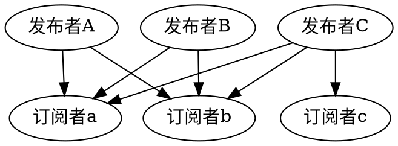

# Feed 流设计

<!-- ```sequence

发布者A->订阅者a: 发布消息
发布者B->订阅者a: 发布消息
发布者A->订阅者b: 发布消息
发布者B->订阅者b: 发布消息

``` -->

[参考资料](https://segmentfault.com/a/1190000020185647)


```dot {engine="dot"}
digraph G {
    发布者B -> 订阅者b
    发布者B -> 订阅者a

    发布者A -> 订阅者a
    发布者A -> 订阅者b

    发布者C -> 订阅者a
    发布者C -> 订阅者b
    发布者C -> 订阅者c
}
```
